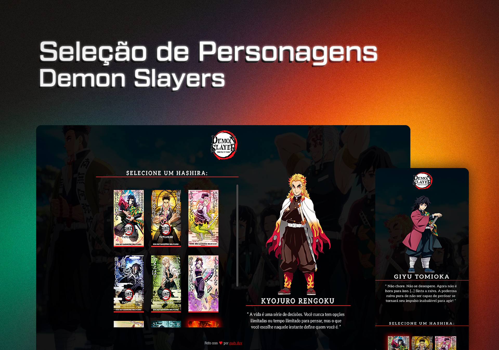

<h1 align="center">Seleção de Personagens - Demon Slayers</h1>

  <a href="#-tecnologias">Tecnologias</a>&nbsp;&nbsp;&nbsp;|&nbsp;&nbsp;&nbsp;
  <a href="#-projeto">Projeto</a>&nbsp;&nbsp;&nbsp;|&nbsp;&nbsp;&nbsp;
  <a href="#-funcionalidades">Funcionalidades</a>&nbsp;&nbsp;&nbsp;&nbsp;&nbsp;&nbsp;

 

  

### 💻 Projeto 
Um projeto de seleção de personagens que aprendi em um evento chamado "Do Zero ao Programador Contratado" - Dev em Dobro.
- [Acesse o projeto finalizado, online](https://devgaab.github.io/proj-selec-personagem-demon-slayers/)

### 🚀 Tecnologias
Esse projeto foi desenvolvido com as seguintes tecnologias:
- HTML e CSS
- JavaScript
- Git e Github

### ⚙ Funcionalidades
- Projeto responsivo
- Interatividade: Ao passar o mouse sobre o card do personagem o nome e a descrição é alterado junto com a imagem principal do personagem selecionado.

---