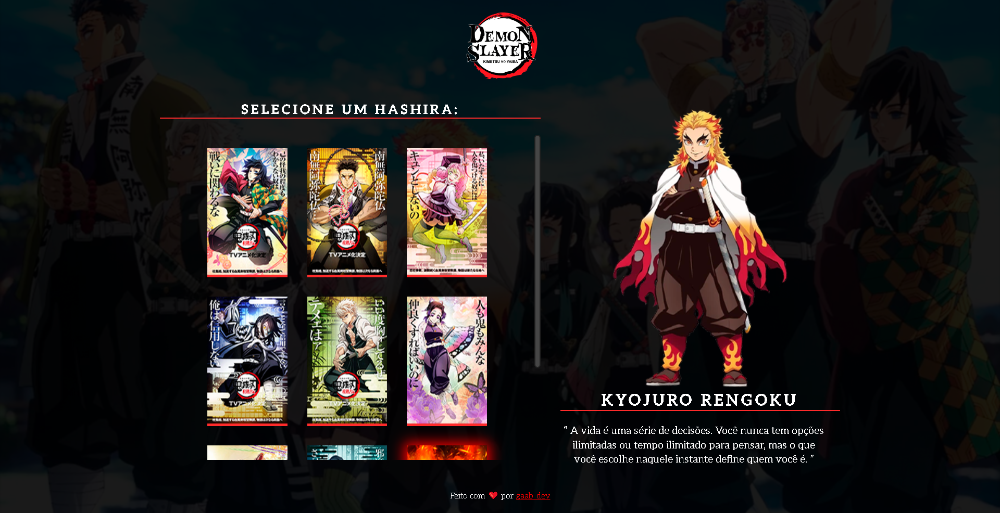
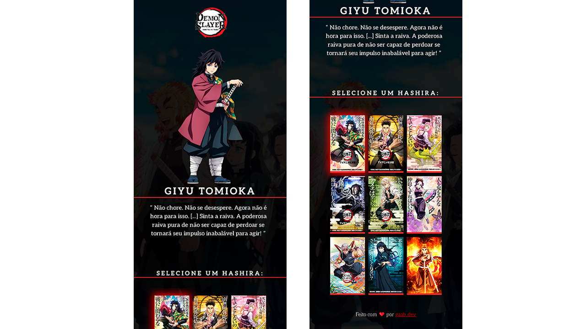

<h1 align="center"> Seleção de Personagens - Demon Slayers </h1> 

### 💻 Projeto 
Um projeto de seleção de personagens que aprendi em um evento chamado "Do Zero ao Programador Contratado" - Dev em Dobro.

### ⚙ Funcionalidades
- Projeto responsivo
- Interatividade: Ao passar o mouse sobre o card do personagem o nome e a descrição é alterado junto com a imagem principal do personagem selecionado.

### 🚀 Tecnologias
- HTML
- CSS
- JavaScript